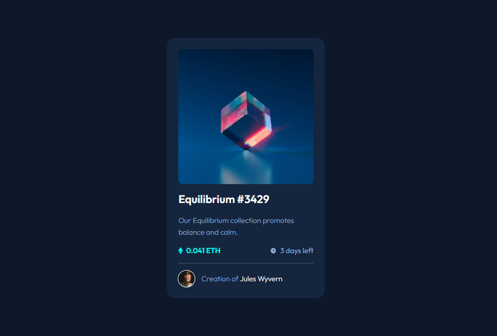

# Frontend Mentor - NFT preview card component

This is a solution to the [NFT preview card component challenge on Frontend Mentor](https://www.frontendmentor.io/challenges/nft-preview-card-component-SbdUL_w0U).

## Screenshot

## Links

- Solution URL -  [GitHub repository](https://github.com/dostonnabotov/nft-preview-card-component-main/)
- Live Site URL - [Live Site](https://dostonnabotov.github.io/nft-preview-card-component-main/)

## Author

- Website - [Doston Nabotov](https://www.dostonnabotov.netlify.com)
- Frontend Mentor - [@dostonnabotov](https://www.frontendmentor.io/profile/dostonnabotov)
- Github - [@dostonnabotov](https://www.github.com/dostonnabotov)
